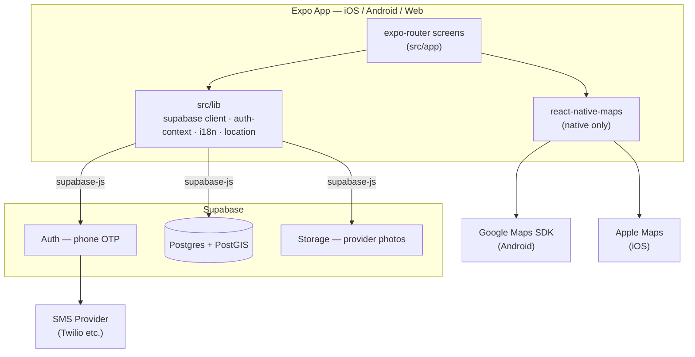
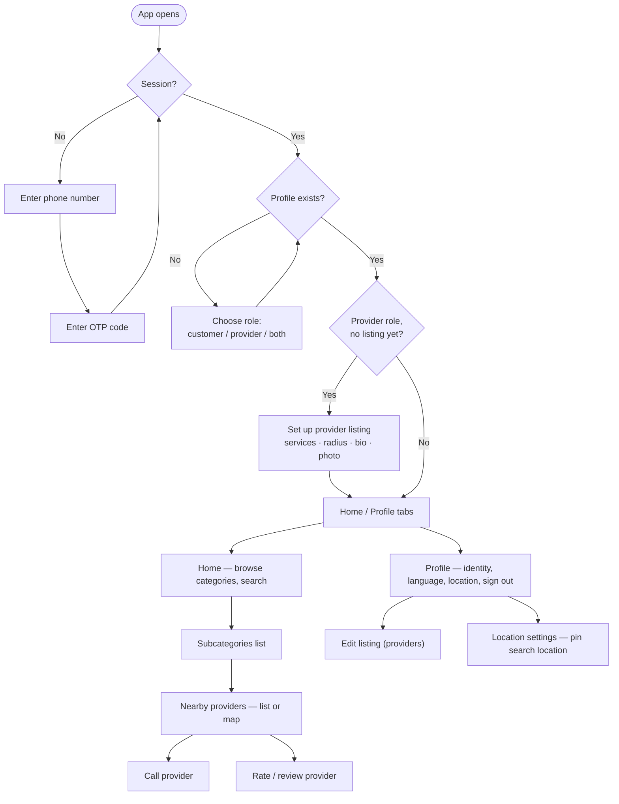
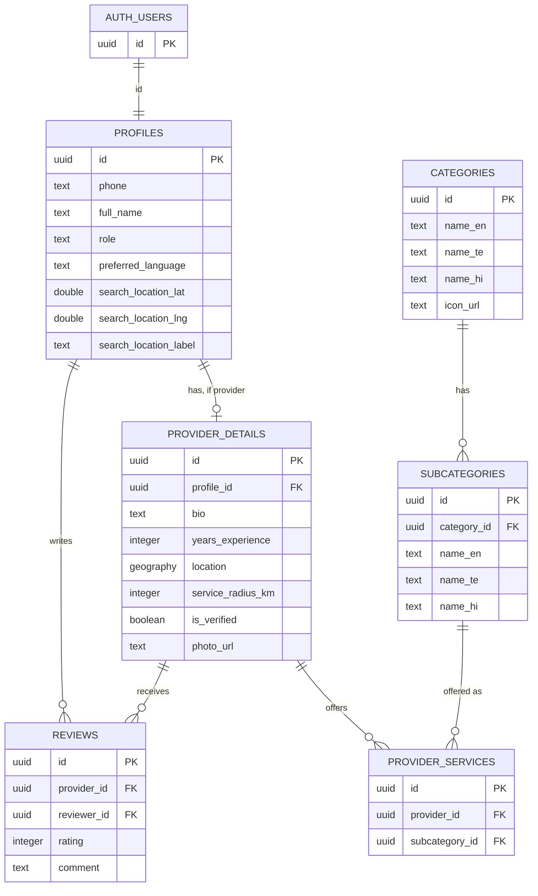

# Seva

A local services marketplace app connecting customers with nearby service providers (electricians, plumbers, carpenters, painters, and more). Built with Expo + Supabase.

## Download

**[Seva v1.0.0 (.apk)](https://github.com/saiesh11/local-services-app/releases/download/v1.0.0/seva-v1.0.0.apk)** — Android only, internal-distribution build. Enable "install from unknown sources" and open the downloaded file. See the [release page](https://github.com/saiesh11/local-services-app/releases/tag/v1.0.0) for details.

## Features

- **Phone (OTP) authentication** — sign in with just a phone number, no passwords
- **Customer browse & search** — category grid with live search, geospatial "nearby providers" results (PostGIS `ST_DWithin`/`ST_Distance`), sorted nearest-first
- **Provider onboarding** — service categories, service radius, years of experience, bio, and a profile photo (Supabase Storage)
- **Reviews & ratings** — one review per customer per provider, average rating + count shown on every listing, a "Verified" badge for admin-verified providers
- **Map view** — toggle between list and map for nearby-provider results, with pins for each provider plus the customer's own location
- **Pinned search location** — search from a chosen address instead of always relying on live GPS
- **Multi-language** — English, Telugu (తెలుగు), and Hindi (हिन्दी), switchable per-user in Profile; category names localize along with the UI
- **Consistent design system** — a shared `Button` component (gradient primary CTA, press animation, haptics) used everywhere, subtle depth/shadows across every card and surface

## Stack

- **App**: Expo (SDK 57) + expo-router, React Native, TypeScript
- **Backend**: Supabase — Postgres (with PostGIS for geospatial search) + Auth (phone OTP) + Storage (provider photos)
- **Maps**: react-native-maps (works in Expo Go on iOS via Apple Maps out of the box; Android needs your own Google Maps key, see below)
- **i18n**: react-i18next — English, Telugu, and Hindi all shipped, driven by `profiles.preferred_language` (switchable in Profile)

## Architecture



There's no custom backend server — Supabase (Postgres + Auth + Storage) is the entire API surface, called directly from the client via `supabase-js`.

## User flow



## Data model



`profiles.id` references `auth.users.id` directly (Supabase-managed). `provider_details.profile_id` is unique — one listing per profile. `reviews` has a unique `(provider_id, reviewer_id)` pair — one review per customer per provider, enforced at the RLS policy level too (a provider can't review themselves). `nearby_providers()` is a PostGIS-backed Postgres function, not a table — it joins `provider_services` → `provider_details` → `profiles`, filters by `ST_DWithin`, and returns distance/rating aggregates sorted nearest-first.

## Getting started

1. Install dependencies

   ```bash
   npm install
   ```

2. Create a `.env` file in the project root with your Supabase project's credentials:

   ```bash
   EXPO_PUBLIC_SUPABASE_URL=https://your-project.supabase.co
   EXPO_PUBLIC_SUPABASE_PUBLISHABLE_KEY=your-anon-key
   ```

3. Set up the database — in the Supabase SQL Editor, run the files under `supabase/` **in this order**:

   1. `schema.sql` — core tables + RLS
   2. `add_search_location.sql` — pinned search location support
   3. `add_provider_photo.sql` — provider listing photo column
   4. `storage_provider_photos.sql` — storage bucket + policies for provider photos
   5. `add_reviews.sql` — reviews/ratings table
   6. `seed_categories.sql` — category/subcategory catalog
   7. `translate_categories.sql` — Telugu/Hindi names for the seeded categories/subcategories
   8. `nearby_providers.sql` — geospatial nearest-provider search function (also returns photo/rating aggregates and lat/lng for map pins)
   9. `seed_dummy_providers.sql` — optional test data for local development

   PostGIS must be enabled on the project (Database > Extensions), and a phone-based SMS provider (e.g. Twilio) must be configured under Authentication > Providers > Phone for OTP login to work.

4. Start the app

   ```bash
   npx expo start
   ```

5. **Map view (Android) setup**, if you want it actually rendering tiles instead of a blank watermarked map:

   1. In Google Cloud Console: create/select a project, **enable billing** (required even for free-tier usage), enable "Maps SDK for Android", create an API key.
   2. Put that key in `app.json` under the `react-native-maps` plugin config (`androidGoogleMapsApiKey`, currently empty).
   3. Build a custom dev client (`eas build --profile development --platform android`) and install that instead of Expo Go — **Expo Go ignores this config entirely**, since it's a fixed pre-built shell that never reads your project's native settings. Editing `app.json` alone will not fix the blank map in Expo Go.

   iOS uses Apple Maps by default — no key needed there, works in Expo Go as-is.

## Building an APK

```bash
npx eas-cli build --platform android --profile preview
```

Uses the `preview` profile in `eas.json` (internal distribution, `.apk` output — installable directly, no Play Store needed). Requires being logged into an EAS account with access to this project (`npx eas-cli login`).

## Project structure

```
src/
  app/            expo-router screens (file-based routing)
  components/     shared UI components
  constants/      theme, category icon map
  hooks/          theme/color-scheme hooks
  lib/            supabase client, auth context, i18n, location helpers
  locales/        i18n translation files (en/te/hi)
supabase/         SQL schema, migrations, and seed data (see Getting started above)
```
